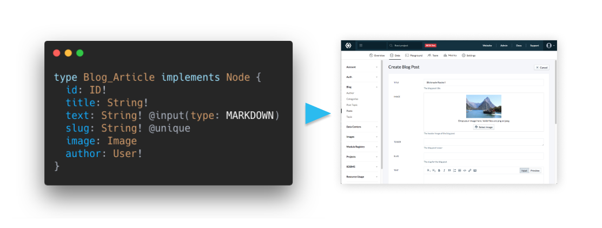

# [Slicknode](https://slicknode.com "GraphQL CMS + Framework") 

 

GraphQL Application Framework and CMS for rapid software development: 

Declaratively define your data model using GraphQL SDL, get a production ready GraphQL API with CMS instantly.

A [powerful permission model]() makes creating multi tenant and enterprise apps with complex rules 
a matter of minutes. 

**Get started here:**

-   **[Quickstart:](https://slicknode.com)** Create a backend from scratch in 5 mins
-   **[Tutorial:](https://slicknode.com/docs/tutorial/)** Learn about Slicknode and GraphQL by building an advanced blogging 
    application with authentication, permissions etc.
-   **[Documentation](https://slicknode.com/docs/)**

**Features:**

-   Instant **GraphQL API** on managed cloud infrastructure
-   Automatic **database migrations**
-   [Declarative permission model](https://slicknode.com/docs/auth/authorization/) (for multi tenant SaaS, customer facing apps, enterprise etc.)
-   Use with any API and database
-   Powerful [data modeling features](https://slicknode.com/docs/data-modeling/introduction/) with
    **[relations](https://slicknode.com/docs/data-modeling/relations/), 
    [interfaces](https://slicknode.com/docs/data-modeling/interfaces/introduction/), 
    [enum types](https://slicknode.com/docs/data-modeling/enum-types/)** etc.
-   **Multi-Stage** development workflow
-   Works with your favorite technologies (React, Angular, Vue, Javascript, iOS, Android etc.)
-   **Headless CMS**
-   [Extensible](https://slicknode.com/docs/extensions/) with custom code (Javascript, TypeScript, Flow etc.)

[Sign up](https://console.slicknode.com/register) to get your free account (no credit card required).

Follow us on [Twitter](https://twitter.com/slicknode) and [Facebook](https://www.facebook.com/SlicknodeHQ/).
