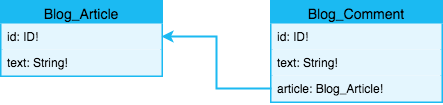

title: Relations: Modeling Relations in GraphQL APIs with Slicknode
description: How to model relations in GraphQL using Slicknode: Many-to-many, one-to-many and one-to-one.

# Relations

Slicknode comes with a flexible system to create relations between the objects that are stored 
in your application. You can create most of the data models of modern applications with a single line
of GraphQL markup. Slicknode automatically takes care of creating the relational tables, 
applying and enforcing foreign key constraints, generating the query API, filter types etc.

It also supports cascading deletes and updates and enforces the data integrity on the database
level for maximum data consistency. 

There are several ways to create relationships between different object types. 

## Stored Relations (One-to-one)

The easiest way to create a relation between two object is by adding a field of that
type to the object: 
 
**For example:**

```graphql hl_lines="11"
type NewsFeed_Author implements Node {
  id: ID!
  nickname: String! @unique
}

type NewsFeed_Article implements Node {
  id: ID!
  
  # This creates a relation to the NewsFeed_Author object
  # Each article has exactly one author
  author: NewsFeed_Author
  text: String!
}
```

Under the hood Slicknode adds a column of type ID to the database table of the article and adds
a foreign key constraint. 

!!! warning "Warning"
 
    When making a related field a required field (`author: NewsFeed_Author!`), Slicknode will automatically 
    delete depending objects. For example if you were to delete an author from the database, all the 
    articles of that author would be automatically deleted as well. This ensures that there are no 
    orphaned records in the database and results in a consistent dataset. If you don't want to enable
    cascading deletes, just add the field with a nullable type. 

## Virtual Relations

If you want to create Many-to-many or One-to-many relationships, or if you want to create relations between objects 
without changing the underlying data storage in the system, you can use virtual relation fields 
and configure the relation via the `@relation` directive. 

The `@relation` directive is a flexible directive to connect object types. It can connect any 
object types in the system without changing the stored data structure. It just adds a field
to the GraphQL object type and performs all the data fetching logic automatically, while 
applying permission filters etc. 

To create a virtual relation, you have to create a field of the connected type and
configure the path along which the objects are connected and can be looked up by the 
Slicknode query engine. This is easiest to understand with a Many-to-many relation example.

### Many-to-many Relation

If you want to create a Many-to-many relation you have to add a virtual relation. 

For example, let's assume you want to build a community module that has persons, groups and 
group memberships. A person can be in many groups and each group can have many members, the classic
Many-to-many relationship. The information about which person is in which group is stored as a membership. This 
membership is also called the "Edge", the connection between the two other nodes. 

This could look something like this in the `schema.graphql` file of your module: 

```graphql hl_lines="5 6 7 8"
type Community_Group implements Node {
  id: ID!
  name: String!
  
  # We want to be able to query for a list of persons that are members in that group
  members: [Community_Person!]! @relation(
    path: "Community_Group=group.Community_Membership.person=Community_Person"
  )
}

type Community_Person implements Node {
  id: ID!
  name: String!
}

type Community_Membership implements Node {
  id: ID!
  person: Community_Person!
  group: Community_Group!
  
  # You can add any number of fields here, to customize the edge. Those values will also be
  # available when querying the edge. You could for example add "createdAt" or "status" etc.
  # This can also be used for filtering the connection
}
```

If you look at the argument `path` of the `@relation` directive on the field `members`, you can see
how the connection is formed for an Many-to-many relation: 

`<SourceNode>=<SourceNodeFieldOnEdge>.<Edge>.<TargetNodeFieldOnEdge>=<TargetNode>`

This is the equivalent of how you would build a join in a traditional SQL database. 

1.  The path is a string that always starts with the typename on which the virtual relation field is added. 
    In this case the field `members` is added on `Community_Group`. 
1.  The next part after the first `=` defines the edge that connects the two nodes. In this example this is
    the edge type surrounded by the two fields that contain the values for the nodes on both sides:

    `group.Community_Membership.person`. On the left side of the edge we have the `group` value that 
    should be equal to the `Community_Group`, and on the right side we have the `person` value that
    should be equal to the `Community_Person`. 
    
1.  The path always ends with the typename of the virtual relation field, in our case `Community_Person`

### One-to-many Relation

Creating a virtual One-to-many relation between two nodes is very similar to creating Many-to-many relations. 
You can use the `@relation` directive and specify the path to the target node. 

Let's assume you want to build a simple blog module with comments. One blog article can have multiple
comments, and we want to have a field `comments` on our article type that returns all the comments
for that specific article. 



Example `schema.graphql` for the blog module: 

```graphql hl_lines="5"
type Blog_Article implements Node {
  id: ID!
  text: String!
  
  comments: [Blog_Comment!]! @relation(path: "Blog_Article=article.Blog_Comment")
}

type Blog_Comment implements Node {
  id: ID!
  text: String!
  article: Blog_Article!
}
```

### One-to-many Relation via Edge

You can also create One-to-many relations via an edge type, similar to the Many-to-many relationship. This can be
useful when you don't want to change any of the nodes that you want to connect or when you want to 
put the connection functionality in a separate module that does not alter the functionality
of any of the existing nodes. 

You can use [type extensions](./extensions.md) to connect the nodes and create the edge type separately.

Let's assume we already have a support ticket module in our project. We also have a machine
inventory module that stores all the machines that a company owns. Now we want to be able to 
assign a support ticket to one machine and then get a list of all tickets for a specific machine
without changing any of the existing modules.

The inventory ticket `schema.graphql` could look something like this:

```graphql
type InventoryTicket_Assignment extends Node {
  id: ID!
  machine: Inventory_Machine!
  ticket: Support_Ticket! @unique
}

extend type Inventory_Machine {
  InventoryTicket_tickets: [Support_Ticket!]! @relation(
    path: "Inventory_Machine=machine.InventoryTicket_Assignment.ticket=Support_Ticket"
  )
}

```

There are two things important here: 

1.  The `@unique` directive on the `ticket` field of our edge ensures that every ticket can only be
    assigned to one machine. This gives us a One-to-many relation. Without the `@unique` directive this 
    would give us an Many-to-many relation. 
1.  The field name of the extension on the type `Inventory_Machine` has to start with the namespace 
    of the app because we are extending a type that is not part of the same module. 
    Also see [type extensions](./extensions.md) for more information. If all the definitions of all the types would
    be within one module, you would have to omit the namespace prefix in the field name.

### One-to-one Relation via Edge

You can also create virtual One-to-one relations between types without changing the connected nodes. 
This looks identical to the One-to-many Relation via Edge. The only difference would be that both
fields on the connecting edge have the `@unique` directive.
 
If we take the previous example but want to ensure that every ticket can only be assigned to one
machine and that every machine can only have one ticket, the schema would look something
like this: 

```graphql  hl_lines="3 4"
type InventoryTicket_Assignment extends Node {
  id: ID!
  machine: Inventory_Machine! @unique
  ticket: Support_Ticket! @unique
}

extend type Inventory_Machine {
  InventoryTicket_tickets: [Support_Ticket!]! @relation(
    path: "Inventory_Machine=machine.InventoryTicket_Assignment.ticket=Support_Ticket"
  )
}
```