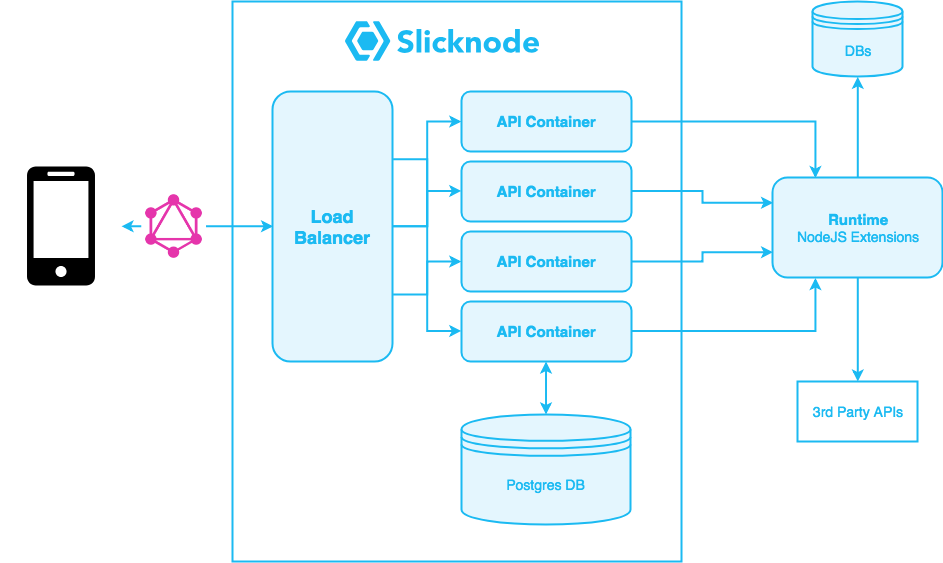

title: Slicknode Extensions: Introduction and Architecture Overview
description: Introduction to Slicknode Extensions, architecture overview and example use cases.

# Extensions and Custom Code

Slicknode has a flexible extension system to add any functionality to your GraphQL API. You can write 
custom resolvers that load data from your existing microservices, write complex business logic
or add hooks to any write operation that happens on your GraphQL server. 

The simplified architecture looks like this:

**Possible Usecases:**

-   Add **3rd party APIs** to your application
-   Embed **legacy APIs** and migrate to a GraphQL architecture
-   Stream write events to **Pub-Sub** systems for realtime updates, IoT devices etc.
-   Write complex **validation and authorization logic**
-   Stream updated data to **external systems** (Kafka, ElasticSearch, Log-Processing etc.)

You can write custom code using plain Javascript or use your favorite build tools
that can compile to Javascript like Typescript or Babel + Flow. 

The runtime environment sits behind the Slicknode GraphQL API and can be deployed in your own
data center or cloud provider of your choice. 

The custom runtime is accessed via HTTP(s) and the communication is secured by cryptographic signing. 

## Use any NPM module

You can use the full Javascript ecosystem and thousands of [NPM modules](https://npmjs.org). 
Slicknode automatically installs the dependencies and compiles your code into a javascript bundle
that you can deploy anywhere. Just add the dependencies to you package.json file and Slicknode takes
care of the rest.
