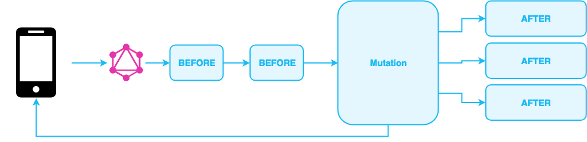

title: Listeners - Serverless event bus for your GraphQL APIs
description: Add custom business logic to your Slicknode GraphQL API via hooks and event listeners.

# Listeners

The functionality of a slicknode server can be extended and manipulated by writing custom logic extensions. 
During the execution of a GraphQL request, events are dispatched by the slicknode server during different
phases of the request. You can configure any number of listeners that execute your custom logic and alter or 
extend the behavior. 

To configure a listener you have to add the event configuration to the listeners section of
your `slicknode.yml` file that contains the code that you want to execute:


**modules/newsletter-subscribe/slicknode.yml:**

```yaml
listeners:
      # The name of the event
    - event: mutation.createUser.AFTER
      # The path to the NodeJS module that contains the code (".js" can be omitted)
      handler: dist/listeners/afterCreateUser
```

This listens to the event `mutation.createUser.AFTER` and invokes the handler that is located in the specified file
whenever the event is dispatched on the server. Some listeners have an additional configuration section
to customize the handler. Please refer to the individual event documentation for details. 

## Mutation Listeners

Whenever a mutation is executed in your GraphQL API, a few events are dispatched that you can use
to intercept the mutation. The architecture looks like this: 



### Before Mutation

Before a mutation is executed, the event `mutation.mutationName.BEFORE` is dispatched. A handler that is 
listening to this event can perform validation logic or manipulate the input values that are passed to the
mutation. 

When a listener of a BEFORE mutation event throws an error, the execution is immediately 
aborted and the mutation is not executed. For example, if you detect invalid input values in the handler
of your listener, you can throw an exception to prevent the data from being passed to the resolver
of the mutation. 

For example to validate the values when a user is added via the `createUser` mutation you
add the listener to the `slicknode.yml` file of the module that implements the logic and write
the handler function. 

**slicknode.yml:**

```yaml
listeners:
    - event: mutation.createUser.BEFORE
      handler: src/listeners/beforeCreateUser
```

**src/listeners/beforeCreateUser:**
```javascript
module.exports = function(payload, context) {
  // Only allow users with @slicknode.com email addresses to be added
  if (!payload.args.input.email || !payload.args.input.email.endsWith('@slicknode.com')) {
    throw new Error('Only users with a slicknode.com email address can sign up.');
  }
}
```

### After Mutation

After a mutation is executed and the data is persisted to the data store, the event
`mutation.mutationName.AFTER` is dispatched. This event can be used to send the persisted
data to external systems or specialized databases (for example search engines or analytics system), 
send out email notifications or cleanup references in external systems when items are deleted etc.

In the listener configuration of your `slicknode.yml` you can also specify what data of the 
mutation payload should be sent to the configured handler as a payload. You can write a query
that queries the data of the mutation payload. 

For example, if you want to subscribe every new user to an external newsletter system, the
configuration of your `slicknode.yml` could look something like this: 

**slicknode.yml:**
```yaml
listeners:
    - event: mutation.createUser.AFTER
      handler: src/listeners/afterCreateUser
      # Additional configuration for this specific listener: 
      config: 
        # Query of the mutation payload to be sent to handler
        query: |
          {
            node {
              email
              firstName
              lastName
            }
          }
```

This selects the `email`, `firstName` and `lastName` of the node to the payload and passes it to the handlers. 
You can query any data that is being returned by the mutation including relationships that are multiple levels
deep etc. 

In the handler you can consume the data as follows.

**src/listeners/afterCreateUser:**

```javascript
module.exports = async function(payload, context) {
  const {firstName, lastName, email} = payload.data.node;
  
  console.log(`User ${firstName} ${lastName} with email address ${email} was added.`);
  
  // Send data to external APIs (Mailchimp, Aweber, Auth-Servers etc.)
};
```

!!! note

    All configured after mutation listeners are executed in parallel and do not block the response. 
    This speeds up the responses for the clients that execute the mutation but also means that the mutation 
    response could be returned before all after mutation listeners have completed execution. 
